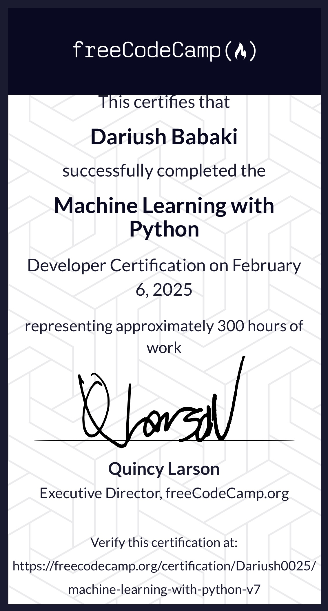

FreeCodeCamp Machine Learning with Python — 2025 Solutions 
=====================

-   [Course Link](https://www.freecodecamp.org/learn/machine-learning-with-python)

-   [My Certificate](https://www.freecodecamp.org/certification/Dariush0025/machine-learning-with-python-v7 )

# Table of Contents 

- [Rock Paper Scissors](https://github.com/dariushbabaki/Machine_learning_with_Python_in_Free_Code_Camp/tree/main/RPS_game)
- [Cat and Dog Image Classifier](https://github.com/dariushbabaki/Machine_learning_with_Python_in_Free_Code_Camp/tree/main/Cat%20and%20Dog%20Image%20Classifier)
-[Book Recommendation Engine using KNN](https://github.com/dariushbabaki/Machine_learning_with_Python_in_Free_Code_Camp/tree/main/Book%20Recommendation%20Engine%20using%20KNN)
- [Linear Regression Health Costs Calculator](https://github.com/dariushbabaki/Machine_learning_with_Python_in_Free_Code_Camp/tree/main/Linear%20Regression%20Health%20Costs%20Calculator)
- [Neural Network SMS Text Classifier](https://github.com/dariushbabaki/Machine_learning_with_Python_in_Free_Code_Camp/tree/main/Neural%20Network%20SMS%20Text%20Classifier)

I finished this course on February 6, 2025.
The picture below shows my certificate after completing all the assignments:

